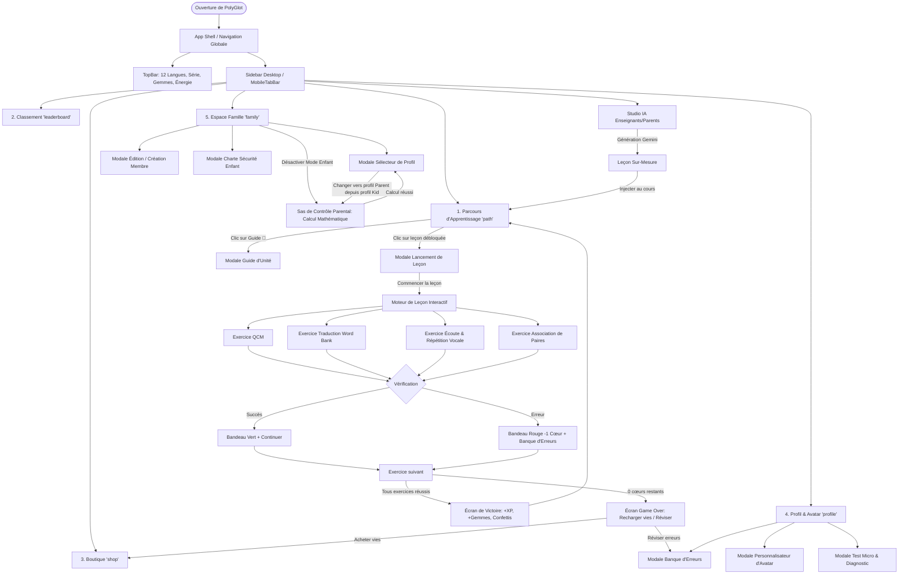

# Documentation Complète de l'Arborescence & Spécifications UI / UX
## Application : PolyGlot (Apprentissage des Langues Multigénérationnel)

---

## 1. Arborescence Hiérarchique Globale

```text
PolyGlot App Shell
│
├── 🧭 Barres de Navigation Permanentes
│   ├── TopBar (Barre Supérieure Globale)
│   │   ├── Sélecteur de Langue (12 langues disponibles)
│   │   ├── Compteur de Série (Streak / Flamme)
│   │   ├── Compteur de Gemmes (Accès rapide Boutique)
│   │   ├── Compteur d'Énergie / Cœurs (Accès rapide Révision / Boutique)
│   │   ├── Sélecteur Rapide de Profil Familial (Bouton switch)
│   │   └── Bouton Test Micro & Diagnostic
│   ├── Sidebar (Navigation Bureau / Desktop)
│   └── MobileTabBar (Barre d'onglets inférieure Mobile)
│
├── 📱 ÉCRANS PRINCIPAUX (Tabs)
│   │
│   ├── 1. Parcours d'Apprentissage (Tab: 'path') [Écran par défaut]
│   │   ├── En-tête d'Unité (Niveau CECRL, Progression, Bouton Guide d'Unité)
│   │   ├── Arbre de Leçons Sinueux (LessonNodes : Verrouillé / Débloqué / Terminé)
│   │   ├── Mascotte Interactive PolyGlot (Conseils & Bulles animées)
│   │   ├── Barre Latérale d'Objectifs (Quête du jour, XP journalier, Coffre)
│   │   └── ↳ Pop-up / Modale : Fiche de lancement de leçon (LessonLaunchModal)
│   │
│   ├── 2. Classement & Ligues (Tab: 'leaderboard')
│   │   ├── Sélecteur de Ligues (Bronze, Argent, Or, Saphir, Rubis, Diamant)
│   │   ├── Compte à rebours hebdomadaire de promotion/relégation
│   │   ├── Podium du Top 3 (Médailles or/argent/bronze & Avatars)
│   │   └── Liste ordonnée des apprenants avec rang, XP et statut
│   │
│   ├── 3. Boutique & Économie Virtuelle (Tab: 'shop' ou Modale)
│   │   ├── Solde de gemmes de l'apprenant
│   │   ├── Section Cœurs & Énergie (Recharge complète de vies)
│   │   ├── Section Séries (Gel de série / Streak Freeze)
│   │   ├── Section Boosters (Double XP temporaire)
│   │   └── Section Garde-Robe & Costumes Mascotte (Tenues à acheter et équiper)
│   │
│   ├── 4. Profil & Personnalisation (Tab: 'profile')
│   │   ├── Carte d'identité apprenant (Avatar interactif, Nom, Langue active)
│   │   ├── Bouton Personnaliser mon Avatar
│   │   ├── Grille de statistiques clés (XP, Jours consécutifs, Gemmes, Leçons)
│   │   ├── Graphique de progression de l'objectif quotidien d'XP
│   │   ├── Grille des Succès & Badges débloquables
│   │   ├── Raccourci vers la Banque de Révision des erreurs
│   │   └── Bouton de test matériel du microphone
│   │
│   └── 5. Espace Famille & Contrôle Parental (Tab: 'family')
│       ├── Bannière d'accueil Familiale (Raccourcis Changer / Ajouter membre)
│       ├── Grille des profils membres (Enfants, Adolescents, Parents)
│       ├── Métriques individuelles par membre (XP, Flamme, Gemmes, Âge, Rôle)
│       ├── Carte Mode Sécurité Enfant & Contrôle Parental (Activation du mode verrouillé)
│       └── Bouton Guide de sécurité enfant
│
├── 🎮 EXPÉRIENCE PLEIN ÉCRAN / SESSION DE JEU
│   └── Moteur de Leçon Interactif (LessonEngine)
│       ├── En-tête : Bouton Fermer/Abandonner, Barre de progression, Vies
│       ├── Exercice 1 : Choix Multiple (QCM audio/texte/illustration)
│       ├── Exercice 2 : Traduction & Reconstitution (Word Bank à ordonner)
│       ├── Exercice 3 : Pratique Orale / Écoute & Répétition (Web Speech API)
│       ├── Exercice 4 : Paires d'Association lexicale
│       ├── Pied de page dynamique de validation (Neutre, Succès vert, Erreur rouge)
│       ├── Écran de Victoire (Bilan XP, Gemmes, Précision, Enregistrement des erreurs)
│       └── Écran d'Épuisement d'Énergie (Plus de vies, options de reprise)
│
└── 🪟 MODALES & POPUPS SYSTÈME
    ├── Modale 1 : Sélecteur de Profil Familial (FamilyProfileSwitcherModal)
    ├── Modale 2 : Éditeur / Créateur de Membre (FamilyMemberEditorModal)
    ├── Modale 3 : Sas de Contrôle Parental / Verrou Mathématique (ParentalLockModal)
    ├── Modale 4 : Guide de Sécurité Enfant (KidsSafeGuideModal)
    ├── Modale 5 : Personnalisateur d'Avatar Vectoriel (AvatarCustomizerModal)
    ├── Modale 6 : Studio Pédagogique IA Enseignants/Parents (ParentTeacherStudio)
    ├── Modale 7 : Guide Pédagogique d'Unité (UnitGuideModal)
    ├── Modale 8 : Banque de Révision des Erreurs (MistakesReviewModal)
    ├── Modale 9 : Diagnostic & Test Audio du Micro (MicrophoneTestModal)
    └── Composant Flottant : Bandeau Permanent Mode Enfant Actif (KidsModeFloatingBar)
```

---

## 2. Fiche Détaillée par Écran

---

### ÉCRAN 1 : Parcours d'Apprentissage (`LearningPath`)
- **Fonction & Objectif** : Écran d'accueil principal. Présente la progression de l'apprenant le long d'un chemin sinueux gamifié, organisé par unités thématiques et niveaux de compétence (CECRL A1/A2/B1).
- **Éléments UI présents** :
  - **Bannière d'Unité** : Nom de l'unité (ex: *"Unité 1 : Premiers Pas en Espagnol"*), sous-titre pédagogique, badge de niveau CECRL, jauge de complétion en pourcentage, bouton *"Guide d'unité 📖"*.
  - **Chemin Sinueux (Stepping Path)** : Suite de nœuds circulaires reliés par des segments courbes.
  - **Nœuds de Leçon (`LessonNode`)** :
    - *Nœud Verrouillé* : Icône cadenas 🔒, teinte grisée, non cliquable.
    - *Nœud En cours / Débloqué* : Cercle 3D coloré avec ombre portée, anneau pulsant, bouton de lecture ▶️.
    - *Nœud Terminé / Maîtrisé* : Étoile dorée ou couronne 👑 avec coche de validation.
  - **Mascotte PolyGlot** : Mascotte animée réagissant aux succès, avec bulle d'encouragement contextuelle.
  - **Volet latéral d'objectifs (Desktop)** :
    - Carte *Défi Quotidien* : Barre de progression d'XP du jour (ex: 20/40 XP).
    - Carte *Coffre de Quêtes* : Récompense débloquable avec bouton de collecte.
    - Raccourci vers la boutique d'accessoires.
- **Actions & Transitions** :
  - Clic sur un nœud débloqué ➔ Ouvre `LessonLaunchModal` (prévisualisation de la leçon et bouton "Commencer").
  - Clic sur "Commencer" dans la modale ➔ Bascule vers `LessonEngine` (plein écran).
  - Clic sur "Guide d'unité" ➔ Ouvre `UnitGuideModal`.
  - Clic sur un drapeau dans la TopBar ➔ Met à jour le parcours avec le cours de la langue sélectionnée (12 langues disponibles).
- **États Secondaires** :
  - *État Débutant / Zéro leçon* : Seule la leçon 1 de l'unité 1 est débloquée, message d'accueil de la mascotte.
  - *État Unité Complétée* : Célébration confettis, trophée de fin d'unité affiché, déblocage de l'unité suivante.

---

### ÉCRAN 2 : Moteur de Leçon Interactif (`LessonEngine`)
- **Fonction & Objectif** : Environnement de jeu immersif et sans distraction où l'apprenant résout des exercices progressifs pour valider la leçon, gagner des XP et des gemmes.
- **Éléments UI présents** :
  - **Barre supérieure de leçon** : Bouton Quitter (croix grise avec dialogue de confirmation), jauge verte segmentée de progression dans la leçon, indicateur d'énergie restante (cœurs rouges ❤️).
  - **Zone d'exercice principale** (selon le type d'exercice) :
    1. *Exercice Choix Multiple (QCM)* : Énoncé, bouton d'écoute audio du mot natif, carte d'illustration emoji, 4 boutons de réponse 3D surélevés avec effet de presse.
    2. *Exercice Traduction & Word Bank* : Phrase à traduire, zone de dépose de la phrase construite (mots cliquables pour les retirer), grille de boutons de mots (Word Bank) à piocher dans le bon ordre.
    3. *Exercice Pratique Orale (Listen & Repeat)* :
       - Phrase modèle écrite avec guide de prononciation.
       - Bouton audio normal 🔊 et bouton audio lent (tortue) 🐢.
       - Bouton géant Micro avec animations :
         - Repos : Cercle blanc avec micro bleu et onde radio.
         - En écoute : Cercle rouge pulsant avec ondes sonores dynamiques réagissant au volume réel de la voix de l'enfant.
         - Validation manuelle : Clic sur le bouton rouge pour stopper l'enregistrement dès la parole terminée.
       - Panneau d'état vocal :
         - Si mot correct : Badge vert avec pourcentage d'exactitude (ex: 95%) et message positif.
         - Si erreur ou mot incompris : Boîte orange détaillée affichant la transcription entendue (`Entendu : « ... »`), le score de proximité, une suggestion de diction et un bouton *"Réécouter le modèle"*.
         - Option de secours : Lien *"Je ne peux pas parler pour l'instant"* (passe sans pénaliser l'énergie).
    4. *Exercice Association de Paires* : Grille 2x4 de cartes de vocabulaire (mots cibles et traductions) à apparier par paires de couleurs.
  - **Pied de page de vérification** :
    - *État d'attente* : Bouton "Vérifier" (désactivé si aucune sélection).
    - *État Succès* : Bandeau inférieur vert émeraude, son de réussite, message d'encouragement *"Excellent !"*, bouton vert 3D "Continuer".
    - *État Erreur* : Bandeau inférieur rouge carmin, son d'erreur, mention de la bonne réponse attendue, retrait d'un cœur d'énergie, bouton rouge "Continuer".
  - **Écran Bilan de Fin de Leçon** :
    - Grande bannière de célébration avec confettis animés.
    - 3 cartes de score : XP gagnés (+15 XP), Gemmes collectées (+5 💎), Pourcentage de précision (ex: 92%).
    - Récapitulatif des erreurs enregistrées dans la banque de révision.
    - Bouton principal "Terminer & Encaisser".
  - **Écran Game Over (Plus de Vies)** :
    - Mascotte attristée, message bienveillant.
    - Bouton "Recharger mes vies dans la boutique" (contre des gemmes).
    - Bouton "Réviser mes erreurs pour regagner 1 cœur".
- **Actions & Transitions** :
  - Clic sur "Terminer" ➔ Retour au `LearningPath` avec le nœud validé et XP crédité.
  - Clic sur Abandonner ➔ Retour au `LearningPath` sans perte d'XP.

---

### ÉCRAN 3 : Classement & Ligues (`LeaderboardView`)
- **Fonction & Objectif** : Tableau compétitif et motivant classant les apprenants selon leur XP hebdomadaire dans des ligues de différents niveaux.
- **Éléments UI présents** :
  - **Bandeau de Ligue** : Icône de la ligue actuelle (ex: Émeraude), jauge de rang, compte à rebours avant la fin de saison (ex: *"Fin dans 2j 14h"*).
  - **Podium des Champions (Top 3)** :
    - Place 1 (Or 🥇) : Avatar agrandi avec couronne, nom, XP, flamme.
    - Place 2 (Argent 🥈) et Place 3 (Bronze 🥉).
  - **Liste ordonnée (Places 4 à 30)** :
    - Lignes alternées avec : Rang numérique, avatar personnalisé, nom du joueur, indicateur de série, total d'XP de la semaine.
    - **Zones de démarcation visuelle** :
      - Zone de Promotion (Top 5) : Surlignage vert pastel avec flèche montante ⬆️.
      - Zone Maintien : Teinte neutre.
      - Zone de Relégation (Derniers) : Surlignage rose pastel avec avertissement.
    - **Ligne Épinglée de l'Utilisateur Actif** : Toujours visible avec bordure distinctive pour se situer instantanément.
- **Actions & Transitions** :
  - Consultation passive et stimulation gamifiée.
  - Clic sur les onglets de navigation pour retourner au cours ou visiter la boutique.

---

### ÉCRAN 4 : Boutique de Gemmes & Améliorations (`ShopView`)
- **Fonction & Objectif** : Magasin virtuel permettant d'échanger les gemmes gagnées par l'effort pédagogique contre des améliorations de jeu et des éléments cosmétiques.
- **Éléments UI présents** :
  - **En-tête Solde** : Affichage géant du solde de gemmes de l'apprenant (💎) avec animation lors des achats.
  - **Section Cœurs & Énergie** :
    - Carte *Recharge Complète* (5 cœurs instantanés) - Prix : 150 gemmes. Bouton Acheter / Recharger.
    - Carte *Vies Illimitées temporaires* - Badge premium.
  - **Section Protection de Série** :
    - Carte *Gel de Série (Streak Freeze)* : Empêche la perte de la flamme en cas de jour manqué. Compteur de gels en stock (ex: 1/2 possédés). Bouton d'achat.
  - **Section Boosters d'XP** :
    - Carte *Potion Double XP (15 minutes)* : Double tous les gains de leçons.
  - **Section Garde-Robe & Costumes Mascotte** :
    - Carte *Tenue Super-Héros* (Cape et masque héroïque).
    - Carte *Tenue Traditionnelle*.
    - Carte *Costume Savant Fou* (Lunettes et blouse).
    - Boutons d'état : *"Acheter pour 300 💎"*, *"Équiper"*, *"✓ Équipé"*.
- **Actions & Transitions** :
  - Achat d'un item ➔ Déduction des gemmes, son de caisse enregistreuse, mise à jour immédiate du profil.
  - Équipement d'un costume ➔ Met à jour l'apparence de la mascotte sur l'ensemble de l'application.
  - Bouton Fermer (si ouvert en modale) ➔ Retour à l'écran précédent.

---

### ÉCRAN 5 : Profil & Personnalisation (`ProfileView`)
- **Fonction & Objectif** : Espace personnel récapitulant les accomplissements de l'apprenant, son avatar 2D interactif, son historique de pratique et ses badges de maîtrise.
- **Éléments UI présents** :
  - **Carte Profil** : Avatar interactif grand format (réactif au survol et clics), nom du profil avec bouton d'édition rapide, date d'inscription, langue courante avec drapeau national.
  - **Bouton d'action "Personnaliser mon Avatar"** : Bouton stylisé avec baguette magique.
  - **Grille de 4 Statistiques Clés** :
    - 🔥 Flamme de Série (Jours consécutifs).
    - ⚡ Total XP cumulé.
    - 💎 Gemmes en réserve.
    - 📚 Nombre de leçons complétées.
  - **Graphique d'Objectif Quotidien** : Jauge circulaire ou barre d'accomplissement de l'objectif du jour (ex: 20/40 XP).
  - **Galerie des Badges de Succès** :
    - Badges débloqués : Couleurs vives, date d'obtention, intitulé (ex: *"Premier Pas"*, *"Polyglotte 3 langues"*, *"Sans Faute"*).
    - Badges verrouillés : Grisés avec jauge d'avancement (ex: *"Série de 30 jours (12/30)"*).
  - **Raccourci Banque d'Erreurs** : Carte d'alerte avec le nombre de notions à consolider.
  - **Outils Utilitaires** : Bouton de test et calibration du microphone.
- **Actions & Transitions** :
  - Clic sur "Personnaliser mon Avatar" ➔ Ouvre `AvatarCustomizerModal`.
  - Clic sur "Réviser mes erreurs" ➔ Ouvre `MistakesReviewModal`.
  - Clic sur "Tester mon micro" ➔ Ouvre `MicrophoneTestModal`.
  - Clic sur "Modifier mon nom" ➔ Édition inline du prénom de l'apprenant.

---

### ÉCRAN 6 : Espace Famille & Tableau de Bord Parental (`family`)
- **Fonction & Objectif** : Hub multigénérationnel conçu pour les parents et enseignants afin de gérer plusieurs profils sur le même appareil, configurer les restrictions du mode enfant et suivre les progrès.
- **Éléments UI présents** :
  - **Bannière Espace Famille** : Titre chaleureux, sous-titre explicatif, bouton *"Changer de profil"* et bouton vert *"Ajouter un membre"*.
  - **Grille des Cartes Membres de la Famille** :
    - Badge de rôle : *Enfant* (ambre), *Adolescent* (violet), *Parent* (bleu).
    - Bouton icône Crayon : Édition des paramètres spécifiques du membre.
    - Avatar ou emoji du profil, Prénom, Âge indiqué.
    - Statistiques individuelles du membre : XP, Série, Gemmes.
    - Bouton de sélection : *"✓ Profil Actif"* (si sélectionné) ou *"Sélectionner ce profil"*.
  - **Carte de Sécurité Enfant & Contrôle Parental** :
    - Icône bouclier 🛡️ doré.
    - Explication du sas de sécurité (calcul mathématique requis pour sortir, temps d'écran bridé, zéro publicité).
    - Bouton Toggle : *"Activer Mode Enfant"* / *"Désactiver Mode Enfant"*.
    - Bouton *"En savoir plus"* ouvrant le guide de sécurité enfant.
- **Actions & Transitions** :
  - Clic sur "Sélectionner ce profil" ➔
    - Si le profil actuel est en Mode Enfant : Déclenche le sas `ParentalLockModal`.
    - Si mode adulte : Bascule instantanément de profil, recharge le cours, les gemmes et la série de ce membre.
  - Clic sur "Ajouter" ➔ Ouvre `FamilyMemberEditorModal` en mode création.
  - Clic sur l'icône Crayon ➔ Ouvre `FamilyMemberEditorModal` en mode modification.
  - Clic sur "Activer / Désactiver Mode Enfant" ➔ Si désactivation demandée, ouvre le `ParentalLockModal`.
  - Clic sur "En savoir plus" ➔ Ouvre `KidsSafeGuideModal`.

---

## 3. Fiches des Modales, Popups et Composants Superposés

---

### MODALE 1 : Sélecteur Rapide de Profil (`FamilyProfileSwitcherModal`)
- **Rôle** : Permet aux enfants ou parents de changer d'apprenant en 2 secondes depuis n'importe quel écran via la TopBar ou la Sidebar.
- **Éléments UI** :
  - Liste défilante des membres enregistrés avec leurs avatars et rôles.
  - Indicateur visuel du profil actuellement connecté.
  - Bouton *"Ajouter un nouvel apprenant"*.
  - Bouton d'accès aux paramètres de contrôle parental.
- **Sécurité** : Si le compte actif est en Mode Enfant, tout changement de profil vers un rôle Parent impose le défi mathématique du `ParentalLockModal`.

---

### MODALE 2 : Éditeur & Créateur de Membre (`FamilyMemberEditorModal`)
- **Rôle** : Formulaire complet de création ou d'ajustement des paramètres d'un apprenant.
- **Éléments UI** :
  - Champ texte : Prénom de l'apprenant.
  - Sélecteur de tranche d'âge / Rôle : Enfant (3-11 ans), Ado (12-17 ans), Adulte/Parent (18+ ans).
  - Champ numérique : Âge réel.
  - Grille de sélection d'Emoji pour l'avatar rapide (animaux mignons, explorateurs, mascottes).
  - Menu déroulant : Langue d'apprentissage initiale parmi les 12 langues.
  - Toggle Switch : Activer le Mode Enfant Sécurisé par défaut.
  - Curseur / Slider : Limite de temps d'écran quotidien (de 10 à 60 minutes).
  - Bouton "Enregistrer les modifications", bouton "Annuler", et bouton rouge "Supprimer ce membre" (avec confirmation).

---

### MODALE 3 : Sas de Contrôle Parental / Verrou Mathématique (`ParentalLockModal`)
- **Rôle** : Barrière de sécurité inviolable par de jeunes enfants pour verrouiller les réglages sensibles, la désactivation du mode sécurisé ou le changement vers un compte parent.
- **Éléments UI** :
  - Icône cadenas et bouclier de sécurité.
  - Question de calcul générée dynamiquement (ex: *"Pour déverrouiller, calculez : 8 × 7 = ?"*).
  - Champ de saisie numérique avec pavé tactile intégré.
  - Bouton "Valider".
  - Gestion d'erreur : Si mauvaise réponse, le calcul se régénère et un message d'alerte rouge s'affiche.
  - Bouton Fermer / Abandonner.

---

### MODALE 4 : Guide de Sécurité & Charte Enfant (`KidsSafeGuideModal`)
- **Rôle** : Fiche d'information pédagogique expliquant la politique de protection des données et de l'attention des enfants.
- **Éléments UI** :
  - 4 piliers illustrés :
    1. *Zéro Publicité & Zéro Traçage* : Aucun contenu commercial intrusif.
    2. *Monnaie 100% Virtuelle* : Impossible de dépenser de l'argent réel, les gemmes se gagnent uniquement en travaillant.
    3. *Contenu Filtré & Adapté* : Thématiques positives, aucun mot inapproprié.
    4. *Préservation du Sommeil & Temps d'Écran* : Rappels automatiques de pause après la limite fixée.
  - Bouton "J'ai compris".

---

### MODALE 5 : Personnalisateur d'Avatar Vectoriel (`AvatarCustomizerModal`)
- **Rôle** : Atelier créatif pour configurer l'apparence physique de l'avatar cartoon de l'enfant.
- **Éléments UI** :
  - **Zone de Prévisualisation Centrale** : Avatar interactif grand format avec animations de clignement des yeux et sourire.
  - **Onglets de Configuration** :
    - *Style de visage / Expression* (Grand sourire, Clin d'œil, Curieux, Lunettes cool).
    - *Couleur de peau* (Nuancier inclusif de teintes naturelles).
    - *Coupe et couleur de cheveux* (Blond, châtain, brun, roux, bleu fantaisie).
  - **Bouton Aléatoire 🎲** : Génère un look surprise instantané.
  - **Bouton Enregistrer** : Sauvegarde la configuration dans le profil familial avec explosion de confettis.

---

### MODALE 6 : Studio Pédagogique IA Enseignants & Parents (`ParentTeacherStudio`)
- **Rôle** : Outil auteur permettant de concevoir en 30 secondes des leçons sur-mesure adaptées aux centres d'intérêt de l'enfant ou au programme scolaire grâce au modèle Gemini.
- **Éléments UI** :
  - **Onglet Création** :
    - Sélecteur de public (Enfants 3-6 ans, Élèves primaire/collège, Adultes).
    - Champ texte "Thématique de la leçon" (ex: *"Les dinosaures du Crétacé"*, *"Prendre le métro à Madrid"*, *"Préparer une pizza"*).
    - Champ texte "Focus grammatical ou lexical".
    - Sélecteur du nombre d'exercices à générer (de 3 à 8).
    - Bouton principal avec baguette magique : *"Générer avec l'IA"*.
    - Indicateur de chargement animé pendant la génération.
  - **Onglet Prévisualisation & Déploiement** :
    - Vue détaillée de chaque exercice généré (QCM, traduction, répétition vocale).
    - Bouton *"Ajouter au parcours d'apprentissage"* (intègre la leçon directement au cours courant dans l'unité 1).
    - Bouton *"Imprimer la fiche d'activité (PDF)"* pour un travail sur papier en classe ou à la maison.

---

### MODALE 7 : Guide Pédagogique d'Unité (`UnitGuideModal`)
- **Rôle** : Fiche mémo synthétique consultable avant ou pendant une unité pour comprendre les règles clés.
- **Éléments UI** :
  - En-tête de l'unité avec niveau CECRL.
  - Section *Grammaire & Astuces* : Explications claires, concises et sans jargon des règles de conjugaison ou de syntaxe.
  - Section *Vocabulaire Essentiel* : Liste des mots phares avec leur traduction et bouton de lecture audio TTS pour écouter la prononciation parfaite.
  - Bouton Fermer.

---

### MODALE 8 : Banque de Révision des Erreurs (`MistakesReviewModal`)
- **Rôle** : Système de répétition espacée permettant à l'apprenant de rattraper ses erreurs passées et de restaurer ses cœurs d'énergie sans passer par la boutique.
- **Éléments UI** :
  - Compteur d'erreurs en attente (ex: 3 erreurs à réviser).
  - *État Vide* : Illustration de la mascotte fêtant un carnet d'erreurs vierge (*"Aucune erreur à réviser ! Vous êtes au top."*).
  - *État Actif* : Présentation des questions manquées avec l'erreur commise et la bonne réponse.
  - Bouton de ré-entraînement : Chaque exercice réussi efface l'erreur de la banque et rend **+1 cœur d'énergie**.

---

### MODALE 9 : Diagnostic & Test Audio du Micro (`MicrophoneTestModal`)
- **Rôle** : Outil technique permettant de tester le bon fonctionnement du microphone et de calibrer la reconnaissance vocale de l'appareil.
- **Éléments UI** :
  - Indicateur visuel du statut du micro (Autorisé, En attente, Bloqué).
  - Vu-mètre dynamique avec bargraphe vert/jaune/rouge réagissant au volume ambiant.
  - Échantillon de phrase test dans la langue cible avec bouton d'enregistrement et score de détection phonétique.
  - Accordéon d'aide au dépannage pour autoriser le micro sous Google Chrome, Edge, Safari ou iOS/Android.

---

### COMPOSANT FLOTTANT : Bandeau Mode Enfant (`KidsModeFloatingBar`)
- **Rôle** : Indicateur persistant rassurant les parents et signalant que l'application est en environnement sécurisé.
- **Éléments UI** :
  - Badge coloré *"Mode Sécurité Enfant Actif 🛡️"*.
  - Prénom de l'enfant affiché.
  - Jauge de temps d'écran restant.
  - Bouton *"Quitter le mode enfant"* (déclenche immédiatement le sas de contrôle parental).

---

## 4. Schéma de Flux de Navigation (User Flows)

### Diagramme de Transitions Général (Mermaid)



---

## 5. Synthèse des États d'Écran pour le Design System

| Écran / Composant | État Normal | État Actif / Interaction | État Erreur / Échec | État Succès / Résolu | État Vide / Initial |
| :--- | :--- | :--- | :--- | :--- | :--- |
| **LessonNode** | Cercle 3D vert/coloré | Anneau de pulsation et rebond | Grisé et cadenas fermé 🔒 | Couronne dorée 👑 et coche verte | Non débloqué |
| **Bouton Micro Oral** | Cercle blanc icône bleue | Cercle rouge pulsant + ondes vocales réelles | Encadré orange avec texte entendu et suggestion | Boîte émeraude avec score 95%+ | Invitation au premier clic |
| **TopBar Énergie** | 5 cœurs rouges pleins | Cœur pulsant au survol | 0 cœur + badge d'alerte rouge | Animation de remplissage doré | Cœurs en cours de recharge |
| **Banque d'Erreurs** | Liste d'exercices à retravailler | Carte sélectionnée en révision | Mauvaise réponse répétée | Effacement de l'erreur (+1 ❤️) | Mascotte heureuse "0 erreur" |
| **Profil Familial** | Carte avec badge rôle et stats | Profil actif avec liseré émeraude | Temps d'écran dépassé | Objectif XP du jour atteint 🎯 | Aucun membre additionnel |
| **Sas Contrôle Parental** | Calcul affiché avec pavé tactile | Saisie des chiffres en cours | "Calcul incorrect, réessayez" | Déverrouillage immédiat | Formulaire vierge |

---

*Documentation générée pour la transmission directe aux équipes produit, UI/UX designers (Figma, Penpot) et développeurs front-end.*
